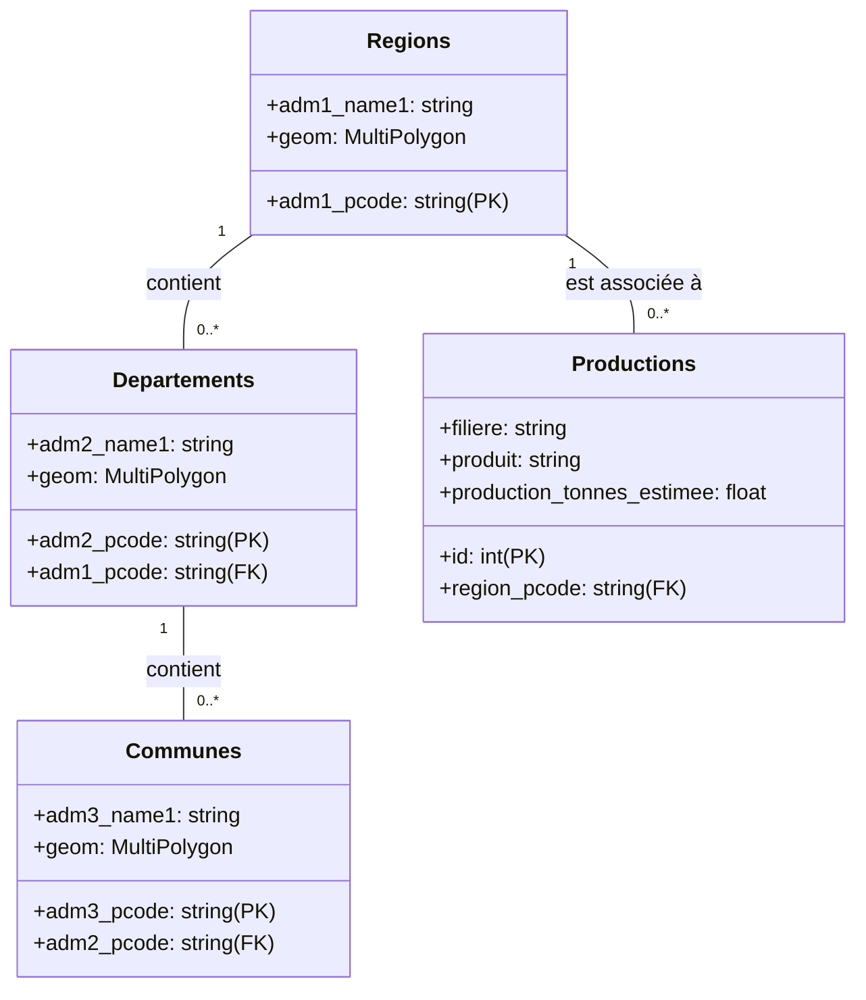
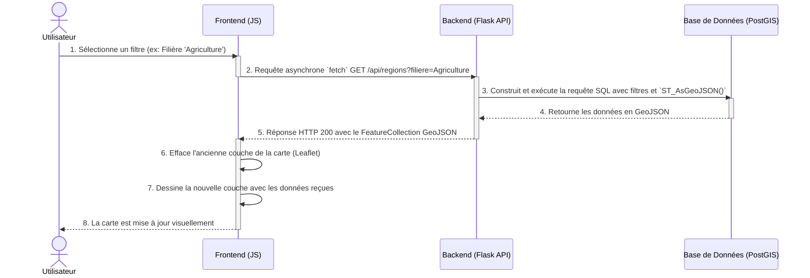

# Rapport d'Ingénieur : Atlas Interactif des Productions du Cameroun

Ce document constitue le rapport technique final du projet de web-mapping des bassins de production du Cameroun. Il présente le contexte, la méthodologie, les choix d'architecture et la conception détaillée de la solution mise en œuvre.

---

## 1. Contexte, Problématique et Objectifs

### 1.1. Contexte Général

Le Cameroun possède une économie riche et diversifiée, largement basée sur des secteurs primaires comme l'agriculture, l'élevage et la pêche. Ces activités sont réparties sur l'ensemble du territoire en "bassins de production", des zones géographiques qui se spécialisent, de manière formelle ou informelle, dans certaines filières. La compréhension de la répartition spatiale de ces forces productives est un enjeu stratégique pour le développement du pays.

### 1.2. Problématique d'Ingénierie

Actuellement, les données relatives à ces productions sont souvent dispersées entre différentes entités (ministères, instituts de statistique, ONG), stockées dans des formats hétérogènes (PDF, CSV, tableurs) et rarement géoréférencées de manière exploitable. Cette fragmentation de l'information constitue un obstacle majeur à une prise de décision éclairée.

Pour des acteurs variés — planificateurs gouvernementaux, investisseurs potentiels, chercheurs ou simples citoyens — il est complexe de répondre à des questions simples mais fondamentales :
- Où se situent les principaux bassins de production de cacao ou de maïs ?
- Quelle région administrative domine la production bovine ?
- Comment se comparent les rendements entre les différents départements d'une même région ?

Le besoin d'un **outil d'aide à la décision**, capable de centraliser, synthétiser et représenter ces informations spatialement, est donc primordial. Le défi d'ingénierie consiste à transformer des données brutes et déstructurées en une connaissance visuelle, interactive et actionnable.

### 1.3. Objectifs du Projet

Ce projet a pour objectif principal de **concevoir et développer une solution de web-mapping pour cartographier les bassins de production du Cameroun**.

Les objectifs spécifiques sont les suivants :
1.  **Centraliser les données** : Créer une base de données géospatiale unifiée regroupant les contours administratifs (régions, départements) et les statistiques de production associées.
2.  **Offrir une interface intuitive** : Développer une application web interactive permettant une exploration simple et fluide des données, sans nécessiter de compétence en SIG (Système d'Information Géographique).
3.  **Permettre une analyse multi-critères** : Implémenter des fonctionnalités de filtrage dynamique par filière (agriculture, élevage), par produit/bassin (cacao, bovins) et par division administrative.
4.  **Fournir des visualisations pertinentes** : Proposer différents modes de représentation cartographique (symboles proportionnels, carte de chaleur) pour faciliter l'analyse visuelle et la détection de tendances spatiales.

---
## 2. Méthodologie et Choix Technologiques

Cette section décrit la démarche globale adoptée, depuis le traitement des données jusqu'à la restitution visuelle.

### 2.1. Démarche Méthodologique

Le projet a été structuré en trois grandes étapes itératives :

**Étape 1 : Structuration et Chargement des Données**
La première étape a consisté à mettre en place une base de données spatiale robuste.
- **Automatisation :** Un script Python (`load_data.py`) a été développé pour automatiser entièrement ce processus, garantissant la reproductibilité de l'import.
- **Nettoyage et Standardisation :** Avant l'importation, le script effectue plusieurs opérations cruciales :
    1.  **Standardisation du CRS :** Toutes les données géographiques ont été reprojetées en **WGS 84 (EPSG:4326)**, le standard pour le web-mapping.
    2.  **Uniformisation des géométries :** Les géométries de type `Polygon` ont été systématiquement converties en `MultiPolygon` pour assurer une structure de table homogène.

**Étape 2 : Développement du Service Backend (API)**
Un service web a été créé pour exposer les données de manière contrôlée et performante au client web.

**Étape 3 : Conception de l'Interface de Cartographie Interactive**
Le frontend a été développé en se concentrant sur une expérience utilisateur intuitive permettant l'exploration des données à travers des filtres dynamiques et plusieurs modes de visualisation.

### 2.2. Choix Technologiques

| Composant | Technologie | Justification |
| :--- | :--- | :--- |
| **Framework Backend** | **Python (Flask)** | Légèreté, flexibilité et idéal pour créer des API RESTful sans imposer de structure rigide. |
| **Base de Données** | **PostgreSQL + PostGIS** | **PostGIS** est la référence pour le stockage et l'analyse de données géospatiales. Permet de déléguer les traitements lourds (calculs géométriques, conversion GeoJSON) à la base de données. |
| **Accès à la BDD** | **SQLAlchemy & GeoAlchemy2** | ORM Python mature qui facilite la gestion des connexions et la prise en charge des types de données spatiales. |
| **Manipulation de Données** | **GeoPandas & Pandas** | Essentiels dans le script de chargement pour lire, nettoyer et manipuler efficacement les fichiers GeoJSON et CSV. |
| **Bibliothèque Frontend**| **Leaflet.js** | Bibliothèque de cartographie JavaScript légère, open-source, très populaire et dotée d'un riche écosystème de plugins (`Leaflet.heat`). |
| **Graphiques**| **Chart.js** | Permet de créer des graphiques responsives et esthétiques pour l'affichage des détails de production. |

---

## 3. Conception Détaillée et Diagrammes

Cette section présente l'architecture et la conception à l'aide de diagrammes formels.

***Note :*** *Les diagrammes suivants sont décrits en utilisant la syntaxe **Mermaid**. Ce code peut être copié dans un éditeur compatible (comme l'éditeur en ligne de Mermaid ou des plugins pour VSCode) pour générer les images correspondantes.*

### 3.1. Architecture Générale Détaillée

L'application est basée sur une architecture client-serveur à trois niveaux (navigateur, serveur web, base de données), découplant la présentation, la logique métier et le stockage des données.

```mermaid
graph TD
    subgraph "Client (Navigateur Web)"
        A[Utilisateur] --> B{Interface Web (HTML/JS/CSS)};
        B -- Requêtes HTTP (Fetch API) --> C{API RESTful};
        B --> D[Carte Interactive (Leaflet.js)];
        B --> E[Filtres & Graphiques (Chart.js)];
    end

    subgraph "Serveur (Backend)"
        C -- Appels Python --> F{Application Flask};
        F -- Requêtes SQL (SQLAlchemy) --> G{Base de Données};
    end

    subgraph "Base de Données"
        G[PostgreSQL + PostGIS];
    end

    style B fill:#e3f2fd,stroke:#333,stroke-width:2px
    style F fill:#dcedc8,stroke:#333,stroke-width:2px
    style G fill:#fff9c4,stroke:#333,stroke-width:2px
```

### 3.2. Diagramme de Cas d'Utilisation

Ce diagramme montre les interactions possibles entre un acteur (« Utilisateur ») et les fonctionnalités principales du système.

```mermaid
graph TD
  actor Utilisateur
  rectangle "Système d'Atlas Interactif" {
    Utilisateur --|> (Consulter la carte)
    Utilisateur --|> (Filtrer les données)
    Utilisateur --|> (Changer de vue)
    Utilisateur --|> (Afficher les détails de production)

    (Filtrer les données) ..> (Par filière) : extends
    (Filtrer les données) ..> (Par bassin/produit) : extends
    (Filtrer les données) ..> (Par division administrative) : extends

    (Changer de vue) ..> (Activer vue Symboles) : extends
    (Changer de vue) ..> (Activer vue Carte de chaleur) : extends
  }
```

### 3.3. Diagramme de Classes de la Base de Données

Ce diagramme modélise la structure de la base de données PostGIS.

- **Regions**, **Departements**, **Communes** : Contiennent les informations géographiques et la géométrie (`geom`).
- **Productions** : Table factuelle contenant les données de production, liée à une division administrative.



### 3.4. Diagramme de Séquence : Scénario de Filtrage

Ce diagramme illustre le déroulement des interactions lors du filtrage de la carte, le scénario d'utilisation le plus courant.



---
## 4. Description des Architectures

### 4.1. Architecture Backend (Serveur Flask)

Le backend est une application **Flask** qui expose une **API RESTful**.
- **Point d'entrée :** `app.py`.
- **Endpoints principaux :**
    - `/api/{regions|departments|communes}` : Renvoient les contours administratifs au format **GeoJSON**. Ils acceptent des paramètres de filtrage (`filiere`, `bassin`).
        - **Optimisation Clé :** La conversion au format GeoJSON est réalisée directement dans la requête SQL grâce à la fonction `ST_AsGeoJSON(geom)`. Cette technique est extrêmement performante car elle évite de charger les géométries en mémoire côté Python.
        - **Agrégation de données :** Les données de production associées sont agrégées en un champ JSON (`json_agg`) directement dans SQL, minimisant le nombre de requêtes.
    - `/api/{filieres|bassins}` : Fournissent les listes uniques pour peupler les menus déroulants de l'interface.
    - `/api/heatmap` : Calcule et renvoie les données pour la carte de chaleur (latitude, longitude, intensité).

### 4.2. Architecture Frontend (Client Web)

Le frontend est une "single-page application" construite avec **HTML, CSS et JavaScript pur**.
- **Point d'entrée :** `public/index.html`.
- **Moteur de cartographie :** **Leaflet.js** est utilisé pour afficher la carte, les couches et gérer la navigation.
- **Logique applicative (JavaScript) :**
    - **Gestion d'état :** Un objet `filters` maintient l'état des sélections de l'utilisateur.
    - **Interactivité :** Chaque changement dans un filtre déclenche une mise à jour (`updateMap()`) qui reconstruit une requête vers l'API, reçoit les données GeoJSON et redessine la couche sur la carte sans recharger la page.
    - **Communication :** La communication avec le backend se fait exclusivement via des appels **asynchrones (`fetch`)** à l'API RESTful.
